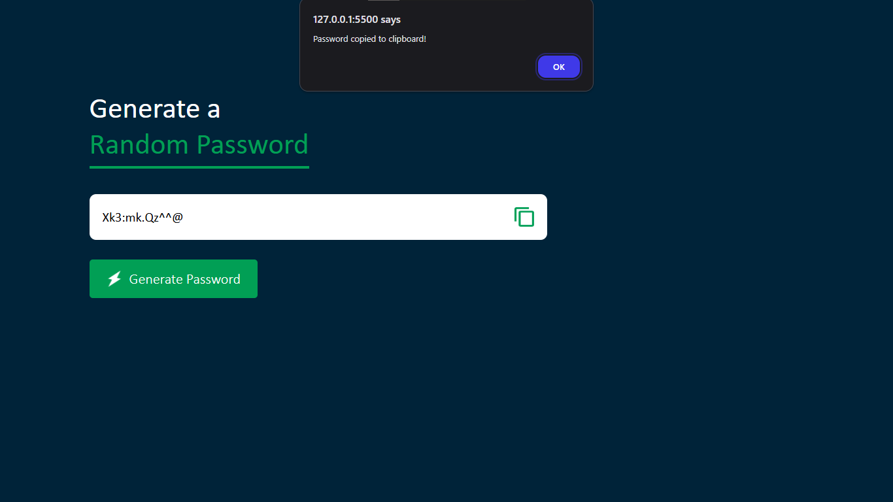

# 🔐 Random Password Generator

A simple and user-friendly web application to generate secure, random passwords instantly. Built using HTML, CSS, and JavaScript, this tool ensures strong password generation for enhanced online security.

📸 Preview


---

## 🚀 Features

✅ One-click random password generation
✅ Copy password to clipboard
✅ Strong password generation using uppercase, lowercase, numbers, and symbols
✅ Clean and responsive UI
✅ Lightweight and fast

## 📁 Folder Structure

```markdown
Password-Generator-web/
│
├── images/
│ ├── copy.png
│ └── generate.png
│
├── pass.html # Main HTML file
├── pass.css # Styling file
├── pass.js # JavaScript logic
└── README.md # Project documentation
```

## 🛠️ Technologies Used

- HTML5
- CSS3
- Vanilla JavaScript

## 🖥️ How to Run

1. Clone the repository :https://github.com/Kaveri-0911/Password-Generator-web.git
2. Navigate to the project folder:
   ```bash
   cd Password-Generator-web
   ```

```
3. Open `pass.html` in your browser (or use Live Server in VS Code)

📌 Future Scope
---------------

* Add password strength indicator
* Allow custom password length
* Enable/disable symbols or numbers toggle
* Add dark mode toggle

🙋‍♀️ Author
-------

Made with 💻 by Kaveri Jadhav

```
